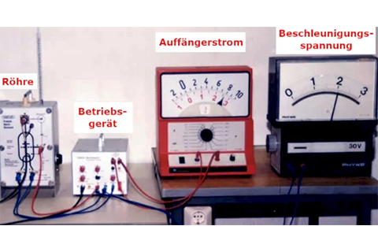
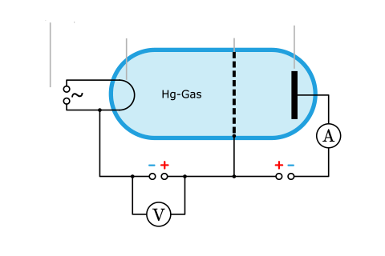
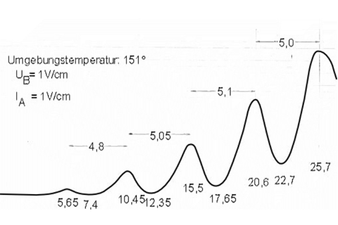

---
options:
    implicit_slide_ends: true
theme:
    name: terminal-dark
title: "Franck-Hertz-Versuch"
author: Jan M.
---

Zweck
===
Der Frank-Hertz-Versuch wurde durchgeführt um die *Existenz von diskreten Energieniveaus in Atomen* nachzuweisen.

Aufbau
===


Diagramm
===

```latex +render
Die Beschleunigungsspannung $U_{B}$ wird variiert.
```

Ergebnisse
===


Warum?
===
Durch den Franck-Hertz-Versuch fand man heraus, dass nur bei bestimmten kinetischen Energiemengen der Zusammenstoß von Elektronen mit Hg-Atomen als inelastischer Stoß vor sich geht.
Das heißt, nur bei bestimmten Energien beim Zusammenstoß Energie übertragen wird.
<!-- newline -->
Man spricht hier vom sogenannten Anregen, da Elektronen in ein höheres Energieniveau versetzt werden.
Bei Quecksilber Atomen befinden sich die Abstände der Energieniveaus bei 4,9**eV**.
