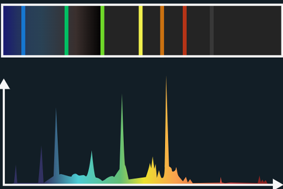
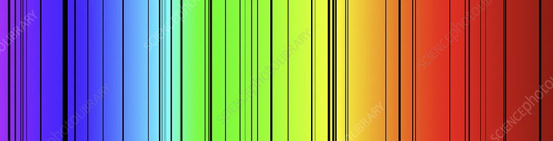

---
options:
    implicit_slide_ends: true
theme:
    name: terminal-dark
title: "Franck-Hertz-Versuch"
sub_title: "(und Absorption & Emission)"
author: Jan M.
---

Zweck
===
Der Frank-Hertz-Versuch wurde durchgeführt um die *Existenz von diskreten Energieniveaus in Atomen* nachzuweisen.

Aufbau
===


Diagramm
===

```latex +render
Die Beschleunigungsspannung $U_{B}$ wird variiert.
```

Ergebnisse
===


Warum?
===
Durch den Franck-Hertz-Versuch fand man heraus, dass nur bei bestimmten kinetischen Energiemengen der Zusammenstoß von Elektronen mit Hg-Atomen als inelastischer Stoß vor sich geht.
Das heißt, nur bei bestimmten Energien beim Zusammenstoß Energie übertragen wird.
<!-- pause -->
<!-- newline -->
Man spricht hier vom sogenannten Anregen, da Elektronen in ein höheres Energieniveau versetzt werden.
Bei Quecksilber Atomen befinden sich die Abstände der Energieniveaus bei 4,9**eV**.
> Bei diesen Anregungen können Elektronen nur ihre _komplette_ Energie abgeben, niemals nur Teile davon.

<!-- end_slide -->
<!-- jump_to_middle -->
Emission & Absorption
===

Emission
===
Nach einer unbestimmten Zeit fallen die angeregten Elektronen wieder in ihr Grundniveau zurück und geben dabei Licht mit einer bestimmten Wellenlänge ab.
Dies nennen wir **Emission**.
<!-- newline -->
Mithilfe der folgenden Formel kann man sich die Wellenlänge des emitierten Lichts aus der Energie des Photons herleiten:
```latex +render
$ E_{ph} = E_{2} - E_{1} $ mit $ E_{ph} = h * f $\\
$ h * f = E_{2} - E_{1} $\\
$ \Leftrightarrow f = \frac{E_{2} - E_{1}}{h} $\\
eingesetzt in $ \lambda = \frac{c}{f} $:\\
$ \lambda = \frac{c * h}{E_{2} - E_{1}} $\\
```

<!-- pause -->
---
### Emissionsspektren

<!-- column_layout: [1, 1] -->
<!-- column: 0 -->
Die emittierten Wellenlängen können anhand ihrer Wellenlänge (d.h. ihrer Farbe) mit einem Spektroskop dargestellt und abgeschätzt werden.
Im rechten Bild ist eine Darstellung eines sogenannten _Emissionsspektrums_ zu sehen, in diesem Fall das einer Hg-Dampflampe.
<!-- column: 1 -->


Absorption
===
Das selbe Prinzip der Anregung kann auch durch Photonen erfolgen.
Im Falle einer Hg-Dampflampe werden die Atome durch einfallendes Licht angeregt, wobei das einfallende Licht _absorbiert_ wird.
<!-- pause -->
Die Photonen übertragen dabei wieder ihre **gesamte** Energie.
Die angeregten Elektronen fallen ebenfalls wieder in ihr Grundniveau zurück und emmitieren Licht mit der aufgenommenen Energie.
Diese Emission ist allerdings unabhängig von der Einfallsrichtung, weshalb hinter dem Absorber sich eine Art Schatten der absorbierten Wellenlängen.

<!-- pause -->
---
### Absorbtionsspektren
<!-- column_layout: [1, 1] -->
<!-- column: 0 -->
Das Absorbtionsspektrum bildet sich aus dem kotinuirlichen Lichtspektrum, aus dem die Wellenlängen des Emissionsspektrums als dunkle Striche dargestellt sind.
<!-- column: 1 -->

